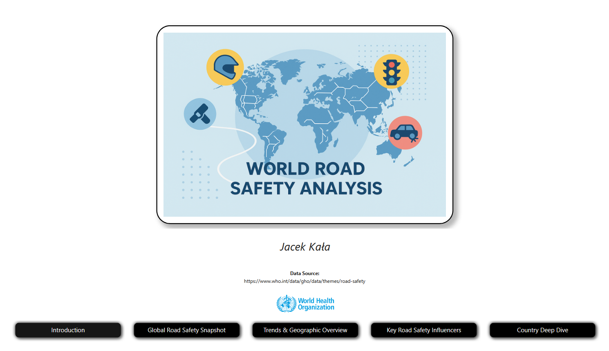

# 🚗 World Road Safety Analysis - Power BI Report 📊

## Overview 🌍

This repository presents a comprehensive analysis of global road safety, exploring various factors that influence road traffic deaths worldwide. The primary goal of this project is to investigate the correlation between road traffic deaths and the adoption of safety standards by drivers (e.g., seat belt usage, driving under influence) and the implementation of vehicle safety standards.

The analysis utilizes data sourced from the World Health Organization (WHO), available at [the WHO road safety page](https://www.who.int/data/gho/data/themes/road-safety). The data for road traffic deaths and death rates comes from 2021, the rest backs to 2017 or 2016.

## Insights 🔍

### Global Road Safety Snapshot 🌐

In 2021, the estimated global road traffic deaths stood at **1.16 million**, with an average death rate of **13.29 per 100,000 population**. WHO utilizes counter-intuitive division into regions (instead of continents), which is also applied in this work.

* **Regional Distribution of Deaths:** South-East Asia accounts for the highest percentage of road traffic deaths (26.51%), followed by the Western Pacific (25.44%) and Africa (19.40%). Europe has the lowest share at 5.39%.
* **Death Rates by Region:** While South-East Asia has the highest number of deaths (308.41K), the highest death rates per 100,000 population are observed in Africa (19.52), while Europe generally exhibits the lowest death rates (6.70).
* **Urban Speed Limits and Traffic Mortality:** The scatter plot shows a varied relationship between maximum urban speed limits and estimated road traffic death rates, indicating that other factors also play a significant role. It's striking to see values over 80 km/h or even 100 km/h in some countries, with speed limits often depending on the vehicle type and numerous other factors.
* **Driver Alcohol Limits:** The distribution of countries by driver alcohol limits shows that the most common threshold is 0.05% Blood Alcohol Concentration (BAC), widely enforced in Europe, with some countries (notably in African and Latin American regions) implementing the highest 0.08% threshold. Five countries in the world execute zero-tolerance policies (0.00% BAC). In Europe, Slovakia and Hungary are highlighted as such countries.

### 2. Trends & Geographic Overview 🗺️📈

* **Seat-belt Usage and Road Deaths:** There is a visible negative correlation between average seat-belt wearing rate and estimated road traffic death rates. This intuitively suggests that higher seat-belt usage rates lead to lower road traffic death rates.
* **Top Countries by Road Traffic Deaths:** 🇨🇳 China (248.10K) and 🇮🇳 India (205.89K) lead in the absolute number of road traffic deaths. These are the biggest countries by population in the world, along with 🇺🇸 the US.
* **Vehicle Safety Standards by Region:** The maps illustrate the legal requirements (defined by the United Nations) for seat-belt system design, electronic stability control, and vehicle crash tests across different regions. It's notable that these standards are widely applied in European countries, although less so in some countries in its Eastern part. On the other hand, they are not commonly applied in African, Middle Eastern, and Western Asian countries, as well as in South America (e.g., China and India do not require ESC systems in their vehicles).

### 3. Key Road Safety Influencers ⚠️

This section identifies key vehicle safety standards and behaviors that significantly influence a decrease in the estimated road traffic death rate.

* **Vehicle Motorcycle Safety Standards:** Having these standards in place leads to a substantial decrease of **9.78** in the average estimated road traffic death rate (per 100,000 population). For example, this bar chart clearly shows a much lower death rate when Motorcycle Safety Standards are in place (approx. 5.17) compared to when they are not (approx. 15.17).
* **Vehicle Safety Standards (Impact on Death Rate Decrease):**

  * Side Crash Test Required: decreases by **9.18**
  * Child Seats Technical Requirements is Yes: decreases by **9.11**
  * Frontal Crash Test Required: decreases by **8.99**
  * Seat Belt Anchorages Required: decreases by **8.02**
* **Seat-belt Usage Rate:** An increase of 27.26% in seat-belt usage rate correlates with a decrease of **0.71** in the average estimated road traffic death rate. 🎯

### 4. Country Deep Dive 🇺🇳

This section allows for a detailed comparison of selected country metrics against global averages.

* **Key Metrics (Global Average):**

  * Est. Road Traffic Deaths (2021): 1.16M
  * Average Death Rate Per 100K (2021): 13.29
  * Alcohol-Related Traffic Deaths (2017): 7.57%
  * Seat-Belt Wearing Rate (2017): 68.65% 🧷
* **Regulatory Questions:** Additionally, the dashboard highlights whether a selected country has:

  * Child seats meeting international standards required.
  * Seat-belt systems meeting international standards required.
  * An officially adopted national road safety strategy.
  * Mandatory pedestrian safety design standards.
